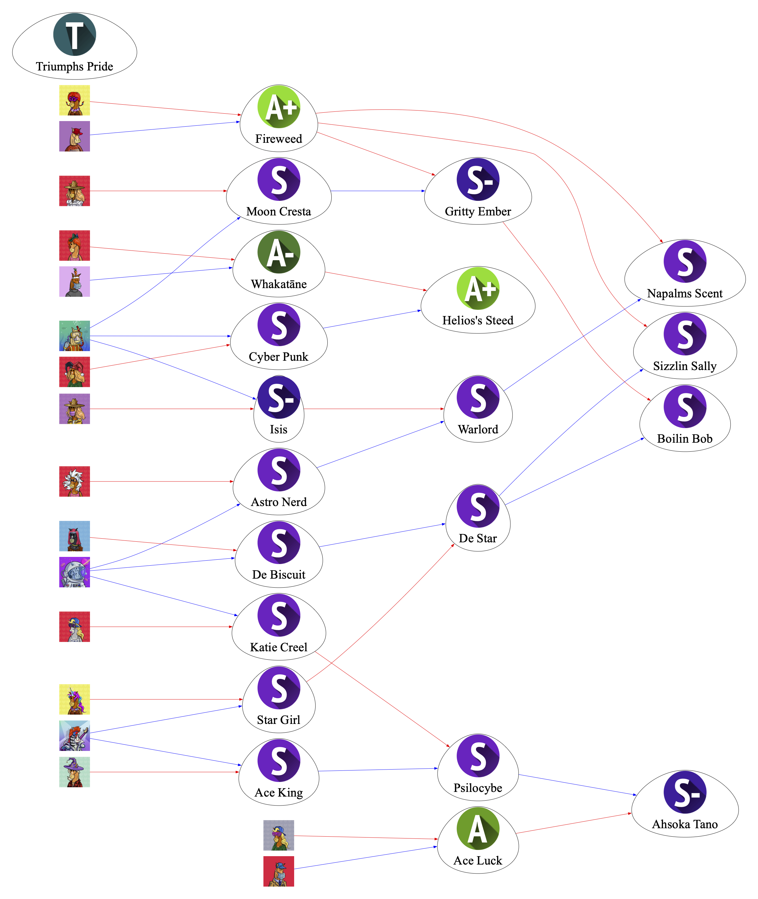

<!-- Improved compatibility of back to top link: See: https://github.com/othneildrew/Best-README-Template/pull/73 -->
<a name="readme-top"></a>


<!-- PROJECT LOGO -->
<br />
<div align="center">
  
  <h3 align="center">PhotoFinish Bloodline Mapping</h3>
   <a>
    
  </a>
  <p align="center">
    An awesome way to map your Stable's Bloodline!
    <br />
    <a href="https://twitter.com/solana_fox"><strong>Created by Solana_Fox</strong></a>
    <br />
    <br />
    <a>Enjoy the tool? Feel free to send a tip to CHDzDXTciRwApZm5g1R28QKoyuN6UHXWBrB57Lj1Sbbm</a>
    ·
    <a href="https://github.com/SolanaFox2/PFL-Bloodline-Mapping/issues">Report Bug</a>
  </p>
</div>


<!-- TABLE OF CONTENTS -->
<details>
  <summary>Table of Contents</summary>
  <ol>
    <li>
      <a href="#about-the-project">About The Project</a>
    </li>
    <li>
      <a href="#getting-started">Getting Started</a>
      <ul>
        <li><a href="#dependencies">Prerequisites</a></li>
        <li><a href="#installation">Installation</a></li>
      </ul>
    </li>
    <li><a href="#usage">Usage</a></li>
    <li><a href="#roadmap">Roadmap</a></li>
    <li><a href="#contributing">Contributing</a></li>
    <li><a href="#contact">Contact</a></li>
  </ol>
</details>


<!-- ABOUT THE PROJECT -->
## About The Project

I built this tool to help visualize my stable's bloodline so I could better prepare and plan my breeding stategy in PhotoFinish. While I do have some coding background, I am not a software engineer.  I say this because the tool is not fast. For larger stables (300+ Horses) you can expect about a 1 min wait for the final product. Be patient please!

At a high level, here's how the code works:
* Looks at your stable ID and pulls all the horses in your stable.
* Goes horse by horse and documents their name, gender, and bloodline
* Plots horses and bloodline

Please feel free to rach out to me on twitter with any comments or suggestions!

<p align="right">(<a href="#readme-top">back to top</a>)</p>


<!-- GETTING STARTED -->
## Getting Started

### Prerequisites

* Python
* pip


### Dependencies

List of python libraries and how to install them.
* selenium - used for webscraping
  ```sh
  pip install selenium
  ```
* Pillow - used for image capture and saving
  ```sh
  pip install pillow
  ```
* Graphviz - used for creating and mapping the bloodline
  ```sh
  pip install graphviz
  ```


### Installation

_Run the code below to clone the GitHub Repo OR download files by following the steps for "Manual Download"_

1. Clone the repo
   ```sh
   git clone https://github.com/SolanaFox2/PFL-Bloodline-Mapping.git
   ```
2. Manual Download
   * Click the green "<> Code" button in the top right
   * Click "Download Zip"
   * Select where to save the zip
   * Unzip the file


<p align="right">(<a href="#readme-top">back to top</a>)</p>


<!-- USAGE EXAMPLES -->
## Usage

To run the code:
1. Open up terminal/ command center
2. Navigate to the directory that contains pfl_bloodline.py
3. Run the program:
  ```sh
  python pfl_bloodline.py
  ```
4. When prompted paste your stable ID and press enter
5. Wait for the code to run through each horse's bloodline
6. A PDF of your stable's Bloodline will appear on your screen!


<!-- ROADMAP -->
## Roadmap

- [ ] Add Changelog
- [ ] Add Node colors to identify female and male horses
- [ ] GUI
- [ ] Add filters for stables to get a subset of your stable
- [ ] Add "components" document to easily copy & paste sections of the readme


<p align="right">(<a href="#readme-top">back to top</a>)</p>


<!-- CONTRIBUTING -->
## Contributing

Contributions are what make the open source community such an amazing place to learn, inspire, and create. Any contributions you make are **greatly appreciated**.

If you have a suggestion that would make this better, please fork the repo and create a pull request. You can also simply open an issue with the tag "enhancement".
Don't forget to give the project a star! Thanks again!

1. Fork the Project
2. Create your Feature Branch (`git checkout -b feature/AmazingFeature`)
3. Commit your Changes (`git commit -m 'Add some AmazingFeature'`)
4. Push to the Branch (`git push origin feature/AmazingFeature`)
5. Open a Pull Request

<p align="right">(<a href="#readme-top">back to top</a>)</p>


<!-- CONTACT -->
## Contact

Solan_Fox - [@solana_fox](https://twitter.com/solana_fox) - solana.fox2@egmail.com

Project Link: [https://github.com/SolanaFox2/PFL-Bloodline-Mapping.git](https://github.com/SolanaFox2/PFL-Bloodline-Mapping.git)

<p align="right">(<a href="#readme-top">back to top</a>)</p>


<!-- MARKDOWN LINKS & IMAGES -->
<!-- https://www.markdownguide.org/basic-syntax/#reference-style-links -->
[contributors-shield]: https://img.shields.io/github/contributors/othneildrew/Best-README-Template.svg?style=for-the-badge
[contributors-url]: https://github.com/othneildrew/Best-README-Template/graphs/contributors
[forks-shield]: https://img.shields.io/github/forks/othneildrew/Best-README-Template.svg?style=for-the-badge
[forks-url]: https://github.com/othneildrew/Best-README-Template/network/members
[stars-shield]: https://img.shields.io/github/stars/othneildrew/Best-README-Template.svg?style=for-the-badge
[stars-url]: https://github.com/othneildrew/Best-README-Template/stargazers
[issues-shield]: https://img.shields.io/github/issues/othneildrew/Best-README-Template.svg?style=for-the-badge
[issues-url]: https://github.com/othneildrew/Best-README-Template/issues
[license-shield]: https://img.shields.io/github/license/othneildrew/Best-README-Template.svg?style=for-the-badge
[license-url]: https://github.com/othneildrew/Best-README-Template/blob/master/LICENSE.txt
[linkedin-shield]: https://img.shields.io/badge/-LinkedIn-black.svg?style=for-the-badge&logo=linkedin&colorB=555
[linkedin-url]: https://linkedin.com/in/othneildrew
[product-screenshot]: images/screenshot.png
[Next.js]: https://img.shields.io/badge/next.js-000000?style=for-the-badge&logo=nextdotjs&logoColor=white
[Next-url]: https://nextjs.org/
[React.js]: https://img.shields.io/badge/React-20232A?style=for-the-badge&logo=react&logoColor=61DAFB
[React-url]: https://reactjs.org/
[Vue.js]: https://img.shields.io/badge/Vue.js-35495E?style=for-the-badge&logo=vuedotjs&logoColor=4FC08D
[Vue-url]: https://vuejs.org/
[Angular.io]: https://img.shields.io/badge/Angular-DD0031?style=for-the-badge&logo=angular&logoColor=white
[Angular-url]: https://angular.io/
[Svelte.dev]: https://img.shields.io/badge/Svelte-4A4A55?style=for-the-badge&logo=svelte&logoColor=FF3E00
[Svelte-url]: https://svelte.dev/
[Laravel.com]: https://img.shields.io/badge/Laravel-FF2D20?style=for-the-badge&logo=laravel&logoColor=white
[Laravel-url]: https://laravel.com
[Bootstrap.com]: https://img.shields.io/badge/Bootstrap-563D7C?style=for-the-badge&logo=bootstrap&logoColor=white
[Bootstrap-url]: https://getbootstrap.com
[JQuery.com]: https://img.shields.io/badge/jQuery-0769AD?style=for-the-badge&logo=jquery&logoColor=white
[JQuery-url]: https://jquery.com 
